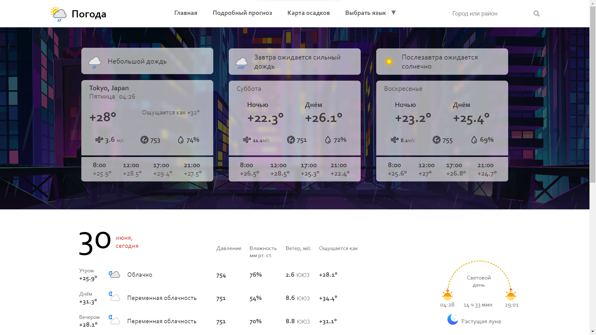
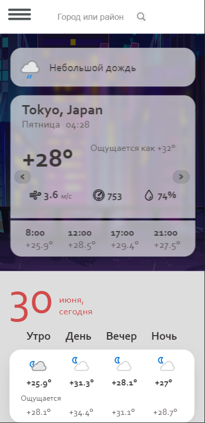
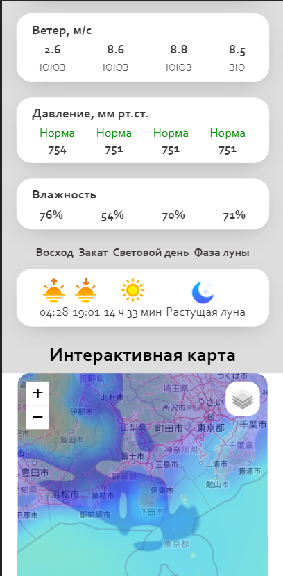
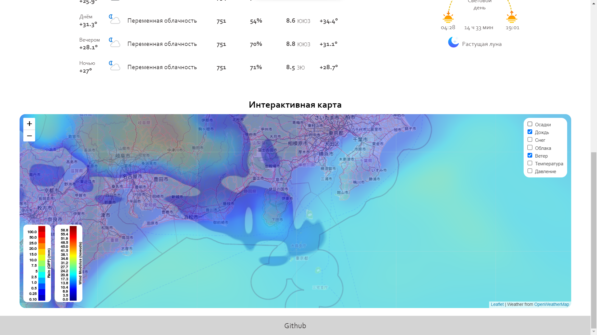

# WeatherReport
      

On <a href='https://alexandrsperansky.github.io/WeatherReport/'>this site</a> you can view the weather forecast for three days, a detailed forecast for today, as well as view an interactive weather map, with precipitation, clouds, and so on.  
A search by city names is also available. Just enter the name of the city, in any register and in any language, and the site will find the weather forecast for this place. The user's location is determined through the IP address, or, if it is not available, through a browser request to the user. 
Technologies such as JS/CSS/HTML were used. All data was taken from open APIs such as openWeatherMap Api, weather api, ip api, Leaflet and geocode.maps. Some of the design elements of the sites were inspired by the Yandex Weather website. 
 
This project is a team training practice at Hexlet College. We worked on this project: <a href='https://github.com/AlexandrSperansky' taregt='_blank'>Boldyrev Alexander</a> - programmer, <a href='https://github.com/mkh1n' target='_blank'>Mukhin Roman</a> - programmer/layout designer, <a href='https://github.com/Larkns' target='_blank'>Ermishkova Anastasia</a> - designer, Kunzhiev Artur - project manager
<a href='https://github.com/H3nt3r' target='_blank'>Shlandakov Evgeniy</a>  - tester
